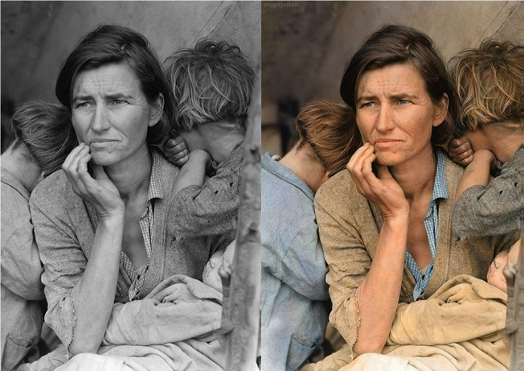
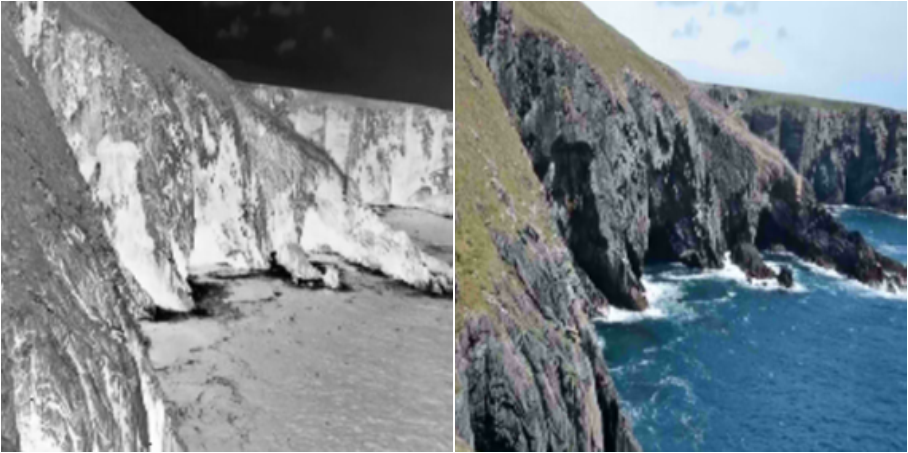
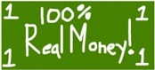
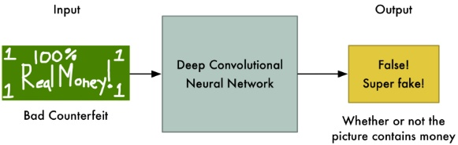
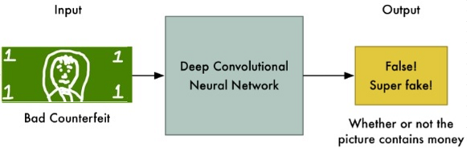
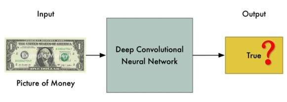
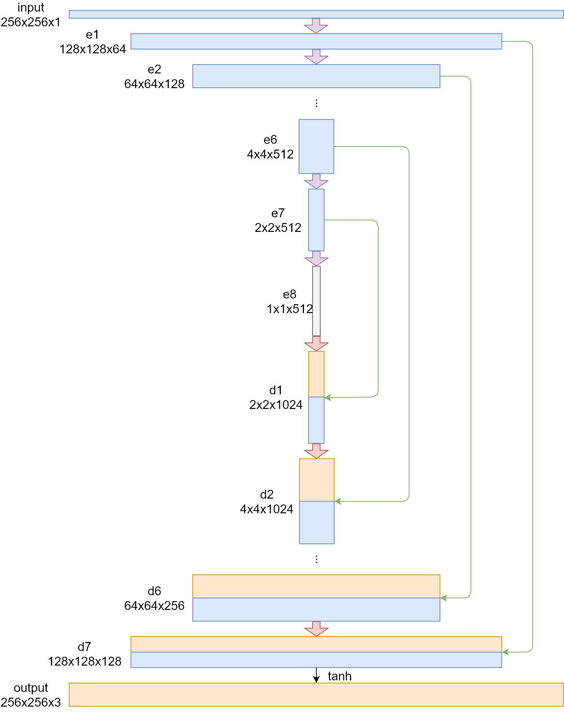
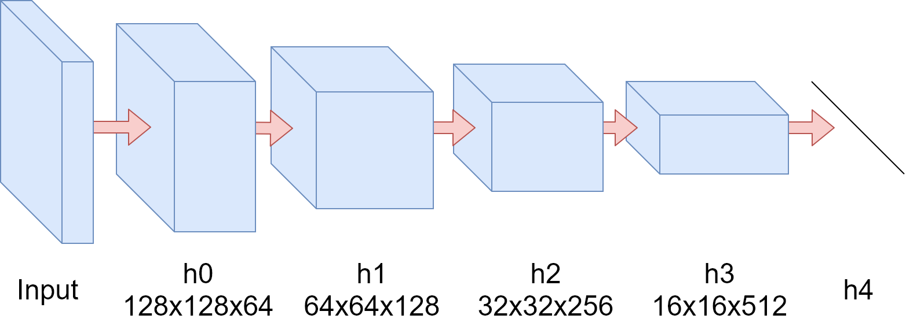
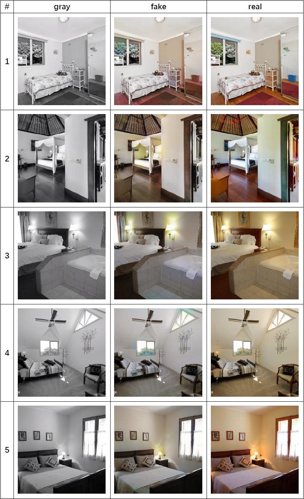

# 1 Introduction

The colorization of old grayscale photographs provides a new perspective for visualizing and understanding the past. It extends the imagination and adds color to old-time photographs, thus enhancing the connection with history and appreciation of history.

Although there is a lack of color information in grayscale photographs, we can understand the scene from the image content and imagine its actual color, which shows that grayscale images still contain some potential information that can restore color, even though we may need to spend a lot of time to fill the color of a grayscale photo. Convolutional neural networks (CNN) can efficiently extract such features from grayscale photos, providing a promising method for rapid automatic colorization. However, the color model based on the convolutional neural network tends to fill the objects' colors as much as possible to their average values, resulting in a brownish color.

Generative adversarial networks (GANs) are a good solution to this problem, first introduced by Goodfellow et al. Stephen Koo uses deep convolutional generative adversarial network (DCGANs), which is an improvement of GAN, to solve the coloring problem. In their work, while they used grayscale images and random noise as generator inputs, the discriminator inputs the generated color image or a true color image, predicting the probability that the input is a true color image. Since the objective function does not rely on Euclidean distance metrics, the model avoids problems in the convolutional neural network model and pro-duces more realistic colors.
In this project, we will make further modifications based on their work. We use a completely different generator network and use Wasserstein GAN instead of DCGAN to improve the stability of the training. Additionally, we have designed a completely new objective function. We hope to gain competitive results compared to DCGAN while improving training stability.

# 2 Method

## 2.1 Overview of GAN
GAN is a quite popular neural net, which literally sparked a lot of interest in adversarial training of neural net, proved by the number of citation of the paper. In order to understand GAN easily, Let’s consider the rosy relationship between a money counterfeiting criminal (called G) and a cashier (called D). 

### Step 1

At the begining, G totally has no idea about how to counterfeit money, so he makes the money like this and give it to D.

For D, he also has no idea about how to discriminate real or fake money, but he has real money (training data), and he knows that there is a head on the real money. So he doesn't accept this money.

### Step 2

After Step 1, G knows that real money have a head, so he makes the money like this and give it to D.

Now although the fake money has a head, there are a lot of differeces between this money and the real money, so D still doesn't accept this money.

### Step N

After lots of steps, although G is always fail, he learns all the features of the real money from this and finally makes the money like this.

Because there are few differences between 'fake' money and real money, now D is unable to discriminate whether it is real.

Overall, in this process, the objective of the money counterfeiting criminal is that he needs to make the money as well as possible in order to fool the cashier. And the objective of the cashier is that he needs to discriminate whether the money he receives is real. This process is called Adversarial Process and GAN is a special case of Adversarial Process. In GAN, money counterfeiting criminal called generator and crashier called discriminator. Normally, these two components are neural net.

## 2.2 Generator

In this project, the generator network uses an encoder-decoder network. This network structure is also called "U-net". Since the input and output of the generator share a large amount of information (structural information provided by the grayscale image, etc.), a skip connection between the encoder and the decoder is also added in the network. The final network structure is shown as follow.

The grayscale image is directly input to the generator, where the input matrix size is (256, 256, 1). The first two dimensions represent the size of the image. Since the grayscale image has only one color channel, the last dimension is 1. Subsequently, after the "convolution-batchNorm-lrelu" operation of the e1 layer, the matrix dimension becomes (128, 128, 64). The e2~e4 layers perform the same operations. The length and width of the output matrix in each layer are reduced by half in layers, and the depth is doubled by layers. Finally, a matrix of size (16, 16, 512) is output in the e4 layer. In the E5~e7 layer, although the operation per-formed by each layer is still "convolution-batchNorm-lrelu", there is no need to continue to increase the depth of the matrix at this time, so its depth remains the same, but the length and width of the matrix is still halved layer by layer.  Finally, a matrix of (1, 1, 512) is obtained at the e8 layer, and the encoder phase of the generator ends. 

The decoder still uses the "convolution-batchNorm-lrelu" module, but the con-volution is replaced by deconvolution, and at the same time, the dropout operation is added after the batchNorm operation in order to add the noise required by the generator. Due to the need of one-to-one correspondence with the encoder, the d1 to d4 layers do not change the depth of the matrix, and the length and width of the matrix doubles layer by layer after the transposition convolution. In addition, there are skip connections between the encoder and the decoder, and the connection is a simple combination of two layers, so the decoder generates twice as much matrix depth as the corresponding encoder. Finally, a matrix of (16, 16, 1024) is output at the d4 level. In the d5~d7 layer, the length and width of the output matrix of each layer are doubled layer by layer, and the depth is reduced by half by layer. Finally, a (128, 128, 128) matrix is obtained at the d7 layer. In the output layer, we use a transpose convolution, and use tanh as an activation function to restore the size of the image, and get the other two color channels predicted by the generator, and finally get a matrix of size (256, 256, 3), which is the color image generated by generator.

## 2.3 Discriminator

Our discriminator network uses a structure called PatchGAN[13]. The discrimina-tor tries to determine whether each patch is real and is implemented by a convolu-tional neural network. Its structure is shown as follow.

The input of the discriminator is a matrix representation of a picture, and a ma-trix with a size of (128, 128, 64) is obtained after a convolution operation at the h0 layer. The h1 to h3 layers follow the convolution-BatchNorm-Relu design pattern. The length and width of the output matrix in each layer are reduced by half in layers and the depth is doubled in layers. Finally, a matrix of size (16, 16, 512) is output in the h3 layer. After the matrix of h4 layer is linear, the unnormalized probability that the discriminator considers the picture to be true is called D logits. Because Wasserstein generates anti-network features, D logits should be used as the output of the network.

## 2.4 Objective

In the design of the objective function, in addition to the loss of WGAN, we added an L1 loss, and the resulting objective function is:

$$L_{total}=L_{WGAN}(G,D)+\lambda L_{L1}(G)$$

where λ is constant, L_WGAN (G,D) is the loss of WGAN and L_L1 (G)   is L1 loss. L1 loss can be expressed as

$$L_{L1}(G)=\mathbb{E}_{x,y,z}[‖y-G(x,z)‖]$$

For WGAN, in order to obtain its objective function, we introduce the concept of Wasserstein distance. The Wasserstein distance is

$$L=\mathbb{E}_{x\sim P_r}[f_w(x)]-\mathbb{E}_{x\sim P_g}[f_w(x)]$$

For the generator, it is optimized to minimize the Wasserstein distance and L1 loss. Its objective function is

$$-\mathbb{E}_{x\sim P_g}[f_w(x)]+\lambda \mathbb{E}_{x,y,z}[‖y-G(x,z)‖]$$

Similarly, the discriminator is optimized to maximize the Wasserstein distance. Its objective function is 

$$\mathbb{E}_{x\sim P_g}[f_w(x)]-\mathbb{E}_{x\sim P_r}[f_w(x)]$$

## 2.5 Training

In the project, we use the RMSProp algorithm to optimize the generator and discriminator objective functions. During training, the discriminator should be over-trained to get as close as possible to the Wasserstein distance, so in each round of training, the discriminator network will train the generator network once per train-ing five times. In the discriminator network training, each training will randomly fetch a group of data from the data set for training, and after the end of the train-ing, the absolute value of all parameters of the discriminator is truncated to no more than a given value. In generator network training, the training method is the same as the discriminator, except that the generator does not need to truncate the parameters.

# 3 Dataset

I select the LSUN bedroom dataset. LSUN is a large-scale color image dataset that contains approximately 1 million marker images in 10 scene categories and 20 object categories. The bedroom scene was chosen because the items in the indoor scene such as a bedroom have various colors. Unlike the outdoor scene, the trees are almost always green, and the sky is always blue. If my model can achieve good results on this data set, I believe that my model can also achieve better results in any scenario. Due to device performance limitations, I only selected 16384 images as the training set (about 20 hours on NVIDIA GeForce GTX 1060 6GB). I cut out one largest center square from each image and compressed them to 256 x 256 pixels.

# 4 Result

Some results are shown as follow.

